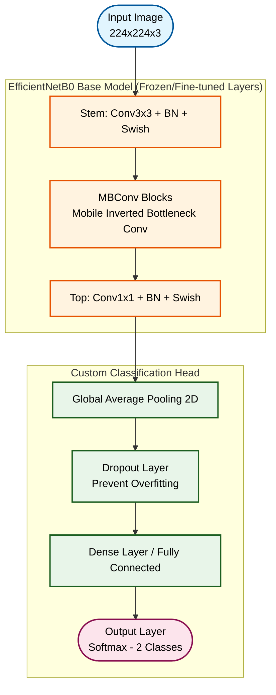
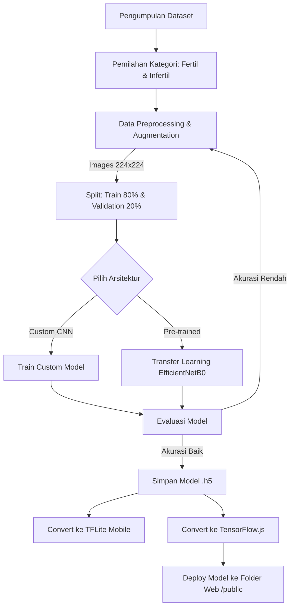
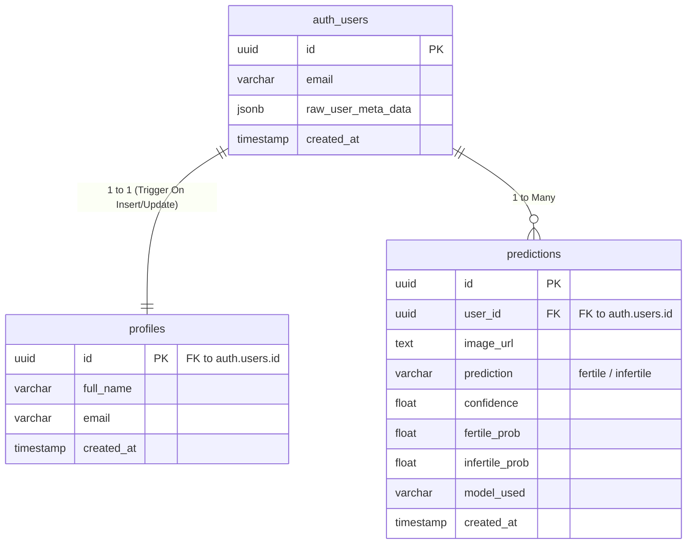
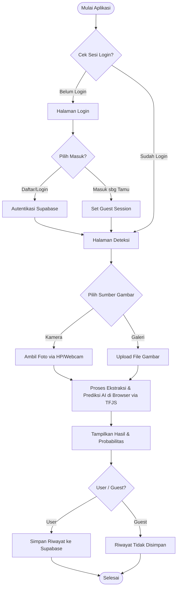
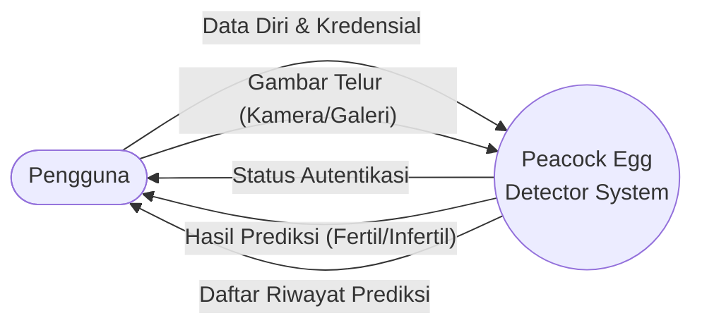
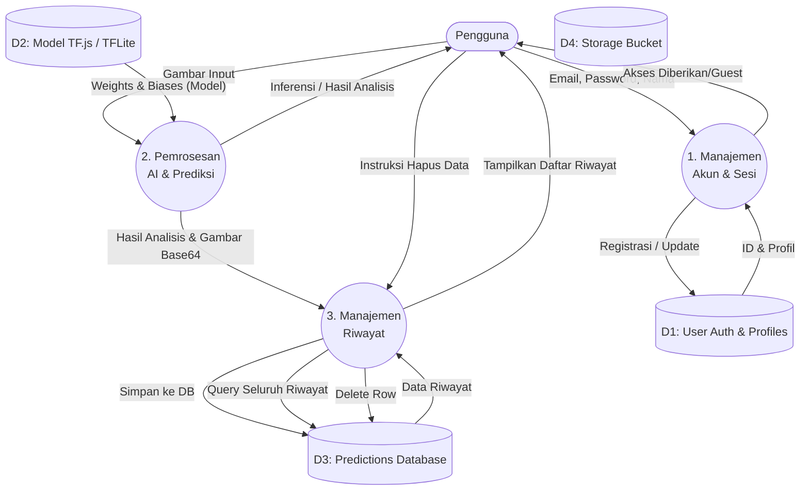

# 🦚 Dokumentasi Lengkap Sistem Deteksi Fertilitas Telur Merak

Dokumen ini menjelaskan keseluruhan sistem aplikasi **Peacock Egg Detector**, mulai dari alur pelatihan model kecerdasan buatan (AI), arsitektur yang digunakan, desain struktur basis data (Database), hingga representasi visual berupa Flowchart dan Data Flow Diagram (DFD).

---

## 1. Algoritma & Arsitektur AI

Aplikasi ini menggunakan pendekatan **Deep Learning** berbasis **Convolutional Neural Network (CNN)** untuk membedakan citra (gambar) telur merak yang fertil (subur) dan infertil (tidak subur). Terdapat dua opsi arsitektur yang disediakan pada sisi *backend*:

1. **Custom CNN Architecture**: Model CNN yang dibangun dari awal *(from scratch)* khusus untuk dataset telur.
2. **Transfer Learning (EfficientNetB0)**: Memanfaatkan model pre-trained (yang sudah dilatih pada jutaan gambar ImageNet) dan dilakukan penyesuaian (*fine-tuning*) pada lapisan *(layer)* terakhir. Metode ini sangat disarankan untuk menangani dataset yang terbatas dan tidak seimbang (*imbalanced*).

### Flowchart Arsitektur CNN (Transfer Learning - EfficientNetB0)

Berikut adalah detail arsitektur model ketika menggunakan pendekatan *Transfer Learning* dari sekumpulan arsitektur *EfficientNetB0*.

**Penjelasan Arsitektur CNN (EfficientNetB0):**

1. **Input Image (224x224x3)**: Gambar telur yang diunggah oleh pengguna akan diubah ukurannya (*resize*) menjadi 224x224 piksel dengan 3 saluran warna (RGB) sebelum dimasukkan ke dalam model saraf.
2. **EfficientNetB0 Base Model**: Ini adalah fondasi utama pengekstraksi fitur *(Feature Extractor)*. Model ini sudah dilatih sebelumnya (*pre-trained*) pada dataset raksasa (ImageNet). Model ini sangat efisien dan mampu mengenali pola visual yang rumit mulai dari tepi, warna, tekstur, hingga bentuk-bentuk kompleks yang ada pada cangkang telur.
   * *Stem & MBConv Blocks*: Serangkaian lapisan konvolusi terbalik *(inverted bottleneck)* beralgoritma efisien yang bertugas mengekstrak fitur visual dari resolusi rendah hingga tinggi.
3. **Global Average Pooling 2D**: Lapisan ini berfungsi untuk meratakan (menyatukan) seluruh peta fitur (*feature maps*) keluaran dari EfficientNet menjadi satu bentuk vektor 1D dengan cara mengambil nilai rata-ratanya. Ini jauh lebih ringan dan mencegah *overfitting* ketimbang lapisan *Flatten* biasa.
4. **Dropout Layer**: Berfungsi untuk mematikan beberapa koneksi sel saraf secara acak selama proses *training* berlangsung. Hal ini krusial agar model tidak sekadar menghafal gambar telur saat *training* (*overfitting*), melainkan benar-benar belajar polanya.
5. **Dense Layer**: Lapisan saraf buatan kustom yang sepenuhnya terhubung *(Fully Connected Layer)* yang kita susun sendiri di ujung arsitektur. Matriks fitur diterjemahkan ke dalam probabilitas klasifikasi.
6. **Output Layer (Softmax)**: Lapis terakhir dalam model ini memiliki 2 sel saraf keluaran yang dipasangkan dengan fungsi aktivasi *Softmax*. Fungsi ini akan merubah angka matematis menjadi probabilitas persentase untuk 2 kelas prediksi akhir: **Fertil** (Subur) dan **Infertil** (Tidak Subur).

### Alur Pelatihan Model (Training Workflow)

Proses dari awal hingga model dapat dipakai di aplikasi web:

---

## 2. Entity Relationship Diagram (ERD) Basis Data

Aplikasi ini menggunakan **Supabase** (PostgreSQL) sebagai *Backend as a Service* (BaaS) yang mengatur Autentikasi dan Basis Data.

> **Keterangan DB:**
> * `auth.users` adalah tabel bawaan Supabase untuk mengelola login.
> * `profiles` disinkronkan langsung dengan `auth.users` menggunakan SQL *Trigger* otomatis.
> * `predictions` memanfaatkan *Row Level Security* (RLS) di mana pengguna hanya dapat melihat dan menghapus riwayat deteksi mereka sendiri.

---

## 3. Flowchart Aplikasi Web

Alur penggunaan aplikasi dari sisi pengguna (User Journey):

### Penjelasan Flowchart:
1. **Pengecekan Autentikasi**: Saat aplikasi dibuka, sistem akan mengecek apakah pengguna memiliki sesi login yang aktif atau memilih mode Tamu (Guest).
2. **Proses Masuk**: Jika belum login, pengguna diarahkan ke halaman Login/Daftar. Pengguna bisa memilih membuat akun (data disimpan ke Supabase) atau masuk sebagai Tamu.
3. **Input Media**: Pada halaman Beranda (Deteksi), pengguna dapat memilih untuk mengambil foto langsung dari Kamera HP atau mengunggah gambar dari Galeri.
4. **Pemrosesan AI**: Gambar yang diinputkan akan diproses oleh model AI yang dijalankan langsung di browser menggunakan TensorFlow.js.
5. **Output & Penyimpanan**: Sistem akan menampilkan hasil (Fertil/Infertil) beserta persentase probabilitas. Jika pengguna login menggunakan akun, hasil ini akan disimpan ke *database* Supabase. Jika menggunakan mode Tamu, hasil hanya ditampilkan sementara dan tidak disimpan.

---

## 4. Data Flow Diagram (DFD)

Data Flow Diagram menggambarkan bagaimana data bergerak di dalam sistem aplikasi ini, mulai dari antarmuka web, pemrosesan kecerdasan buatan, hingga penyimpanan basis data.

### DFD Level 0 (Context Diagram)

Diagram konteks tingkat tinggi dari keseluruhan interaksi.

**Penjelasan DFD Level 0:**
* **Entitas Pengguna** berinteraksi dengan satu kesatuan Sistem utama.
* Alur data masuk (*input*) berupa **Kredensial Login** dan **Gambar Telur Merak**.
* Alur data keluar (*output*) berupa **Status Autentikasi**, **Hasil Prediksi Fertilitas**, dan **Daftar Riwayat Prediksi** yang pernah dilakukan.

### DFD Level 1 (Rincian Proses Utama)

Rincian dari interaksi internal sistem ke berbagai modul data.

**Penjelasan Proses DFD Level 1:**

* **Proses 1. (Manajemen Akun & Sesi):**
  * Menerima input data diri (email, nama, password) dari Pengguna.
  * Memvalidasi kredensial dan mencatat/mengambil data pengguna dari Data Store `D1` (Supabase Auth & Profiles).
  * Mengembalikan status sesi aktif (Akses Diberikan) atau sesi mode Tamu kepada Pengguna.

* **Proses 2. (Pemrosesan AI & Prediksi):**
  * Menerima input gambar telur dari Pengguna.
  * Memuat sekumpulan parameter jaringan saraf tiruan (Weights & Biases) dari Data Store `D2` (File Model TFJS/TFLite yang di-host statis).
  * Melakukan inferensi/prediksi secara *offline* di sisi klien (browser).
  * Menampilkan hasil prediksi ke layar Pengguna, dan mengirimkan paket data hasil beserta *thumbnail* gambar (Base64) ke Proses 3.

* **Proses 3. (Manajemen Riwayat):**
  * Menerima paket data hasil dari Proses 2.
  * Menyimpan data hasil prediksi tersebut ke dalam Data Store `D3` (Tabel Predictions).
  * Mengambil (*query*) seluruh baris riwayat yang dimiliki pengguna dari `D3` dan menampilkannya pada halaman Riwayat.
  * Menerima perintah/instruksi hapus (satuan atau hapus semua) dari Pengguna untuk menghapus (*delete*) baris tertentu pada `D3`.

---
**Catatan Penting Pengembangan:**
Aplikasi ini menjalankan **inferensi AI sepenuhnya di sisi klien (Browser)** menggunakan `TensorFlow.js`. Hal ini menjaga privasi data (gambar tidak melulu perlu dikirim ke server backend untuk dianalisis) dan memberikan hasil seketika (*real-time response*) tanpa beban server yang berlebihan. Server backend Supabase mutlak hanya digunakan untuk fungsi autentikasi dan penyimpanan riwayat (database log).
